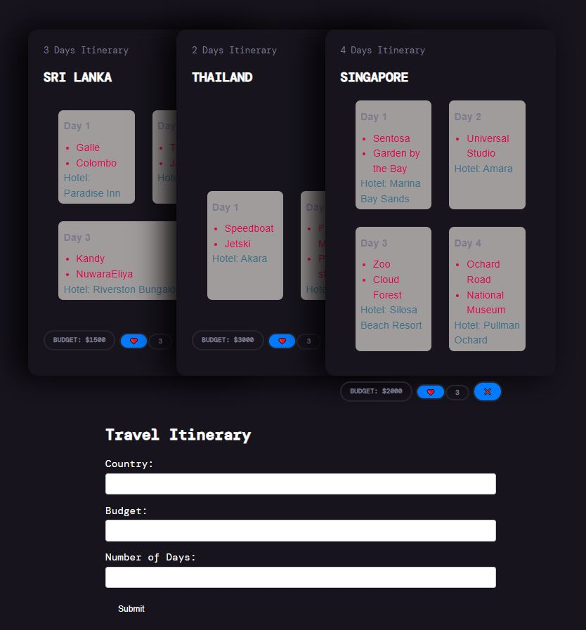

# Itinerary Web App with Appwrite Backend  

I built an itinerary-sharing web app to help travelers plan trips more easily. When I was planning a trip to Thailand, I found it difficult to organize my itinerary, and I realized others might face the same challenge. This inspired me to create a platform where users can share their day-to-day itineraries, including hotels they stayed at and activities they did. All data is stored using an **Appwrite backend**.  

**Project Link:** [Travel Itinerary Web App](https://travel-itinerary-web.netlify.app/)  

  

---

## How It’s Made  

**Tech Stack:** HTML, CSS, JavaScript, Vite, Appwrite  

To run the project locally:  
1. Fork the repository  
2. Run `npm install`  
3. Start the dev server with `npm run dev`  
4. Set up your Appwrite backend to store and manage itineraries  

---

## Optimizations  

Currently, anyone can submit itineraries to the database. Future improvements include:  
- Adding authentication so users can log in and manage their own dashboard  
- Allowing image uploads for each itinerary  
- Enabling users to rate, like, and share itineraries  

---

## Lessons Learned  

- Learned a lot about **JavaScript**, especially handling dynamic changes based on the number of itinerary days  
- Gained experience with **async/await**, event loops, and preventing default reloads  
- Found it tedious to manage components with pure JavaScript — next time I’d use **React** or another frontend framework for better scalability  

